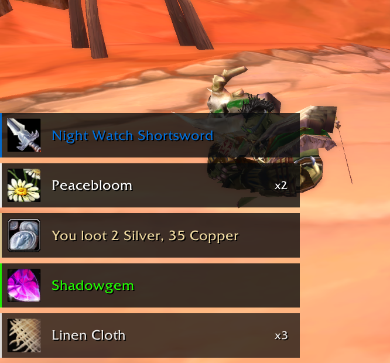
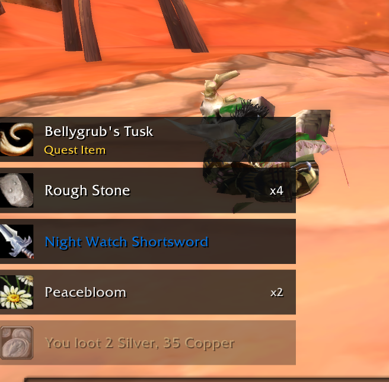
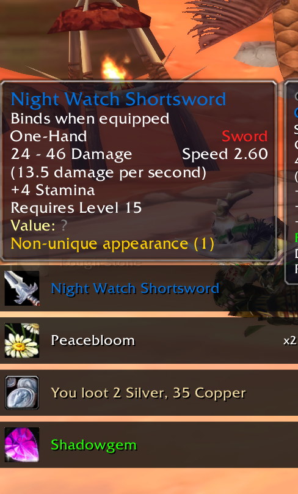

# Octo Loot

A compact, movable loot feed for **OctoWoW / Vanilla WoW 1.12**. No dependencies.

- Five animated loot rows with item icons, rarity colors, and stack counts.
- Copper, silver, and gold icons, plus a gold **Quest Item** label for quest items.
- Hover to pause the feed and see item tooltips.
- Group rolls stay visible with a dice tooltip showing names, Need/Greed/Pass choices, numbers, and the winner.
- Adjustable position, size, duration, and stack direction.

## Install

Download [OctoLoot.zip](https://github.com/Morkahja/OctoLoot/releases/latest/download/OctoLoot.zip), extract the `OctoLoot` folder into `Interface\AddOns`, and restart WoW. Enable **Octo Loot** at character select.

## Commands

- `/oloot unlock` — drag into position; `/oloot lock` to finish.
- `/oloot test` — preview the feed.
- `/oloot testroll` — preview a group roll; hover the dice as it progresses.
- `/oloot scale 1` — adjust size.
- `/oloot duration 6` — seconds before fading.
- `/oloot direction up` or `down` — change stack direction.
- `/oloot chat off` — hide personal item loot in chat; `chat on` restores it.
- `/oloot reset` — restore defaults.

Settings are saved account-wide. Quest labels follow the item's tooltip; ordinary materials needed for quests are not marked.

Group rolls use the normal game's Need/Greed/Pass buttons. Active rolls add rows
as needed and stay until resolved; results remain for 15 seconds, paused while
hovering. The winner appears beside the dice. Detailed loot messages
(`showLootSpam`) are enabled to receive everyone's choices and rolls. Players
whose choice has not been received are shown as waiting/eligibility unknown.
If identical items are rolled simultaneously, Vanilla's chat cannot distinguish
the copies; the tooltip reports that limitation instead of guessing. Missing
results time out explicitly without inventing a winner. Rolls in progress before
the add-on loads cannot be reconstructed.

## Screenshots

